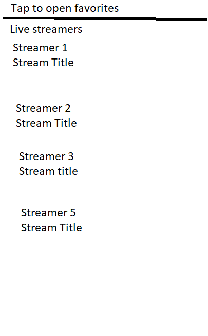

# StreamDex: A Unified Stream Tracker

## Section 1 - Moviation

Online streaming has become a regular part of the digital entertainment space for many people today.  
People of all ages, particularly young people, tune in to watch their favorite streamers every day.  
From gaming, to cooking, to talk shows, to variety streamers, the library of content is vast and   
varied. From this arises a problem for some viewers - how do you keep track of everything? An avid   
stream viewer may have many streamers that he or she likes to follow, some of whom may stream from  
different platforms. Some platforms provide tools to see all of your favorite streamers on one screen,  
but provide little to help a viewer keep them organized. That's where StreamDex comes in. With StreamDex,  
a viewer can track as many streamers as he or she likes, organize them into categories, and see which  
ones are currently live on a single screen. StreamDex will also be compatible with the two largest  
streaming platforms currently on the market, Twitch and Youtube, so no one will have to worry about  
switching between tabs anymore!

## Section 2 - Minimum Requirements

StreamDex will consist of these main screens:

1. A screen from which a user can view a list of any favorite streamers that are currently live
2. A screen from which a user can view all favorite streamers
3. A screen from which a user can edit their list of favorite streamers

Screen #1 will incorporate some functionality from screen #2 while in landscape orientation, showing the viewer a list of all favorite streamers regardless of live status in a sidebar. In portrait orientation it will default to a list of currently live streamers, and will require user input to open a shelf which will display a list of all favorited streamers, and can edit from there. In either orientation, the user will have to use screen #3 dedicated for the purpose of adding or removing streamers from their list.

The only app data that needs to be stored is the list of favorited streamers, and any necessary organizing  
info. This will be stored in on-device storage for now, with potential cloud storage a nice-to-have  
expansion option to be implemented in the future. This data will be created using a default template  
when the user launches the app for the first time, and will be updated whenever the user edits their list.

This information will persist by loading the information out of device storage on app launch, (meaning,  
in the `onCreate()` method of the initial activity) and stored in memory using a model. In the  
activity containing screen #3, this model will be updated with any changes to the streamer list  
that the user wishes to make, and when the activity is destroyed, the changes will be saved to device storage.

StreamDex's communication to the outside world will consist of network requests to retrieve current  
stream status of the user's favorite streamers, and stream embeds and/or links to any currently live  
streams.

## Section 3 - Model, View, Controller

### 3.1 - Models

StreamDex will consist of the following models:

- `Streamer` will hold data for individual streamers being tracked by the app
- `Stream` will hold data for specific streams being tracked by the app
- `CurrentLiveStreamers` will hold a list of `Streamer` objects that have a status of being currently live
- `FavoriteStreamers` will hold a list of `Streamer` objects which the user has favorited

The `FavoriteStreamers` class contains the `addStreamer`, `removeStreamer`, and `clearAllStreamers`
methods. These methods will update the instance of the model in memory, and will also handle storing
the favorites data on device storage for data persistence.

### 3.2 - Views

#### Screen 1

From this screen, users will be able to view all favorite streamers who are currently live. In portrait orientation, there will be an element on which the user can tap to view all favorite streamers regardless of live status. In landscape orientation, this information will be displayed in a sidebar without need for user interaction.

The user will be able to tap on any live streamer (or favorite streamer, in landscape orientation) to be taken to the streamer's current live stream (or to the streamer's channel, in the case that the user tapped on the favorite streamer in the sidebar in landscape orientation).

#### Screen 2

From this screen, users will be able to view all favorite streamers regardless of their current live status. They will be able to tap on an element which will take them back to screen #1. In addition, they will be able to tap on an element to be taken to screen #3. If the user taps on any favorite streamer, they will be taken to that streamer's channel.

#### Screen 3

From this screen, users will be able to view and edit their list of favorite streamers. They will be able to tap on a remove button on each individual streamer in order to remove them from the list after confirmation, and they will be able to tap on a button which will allow them to input a channel link to add the linked streamer's channel to the list. At any time, the user can tap on a button to be returned to screen #2 (or screen #1 in landscape mode).

### 3.3 Controllers

StreamDex will consist of the following controller classes:

- `CurrentLiveStreamersController` will primarily control screen #1, and will hold an instance of the `CurrentLiveStreamers` class which will be used to render the list of currently live streamers
- `FavoriteStreamersController` will primarily control screens 2 and 3, and will hold an instance of the `FavoriteStreamers` class which will be used to render and edit the list of favorite streamers

The `FavoriteStreamersController` class contains the `addStreamer`, `removeStreamer`, and `clearStreamers` methods. These
methods will call the relevant methods in the `FavoriteStreamers` class, which will handle updating the
model in memory as well as storing the persistent data in device storage.